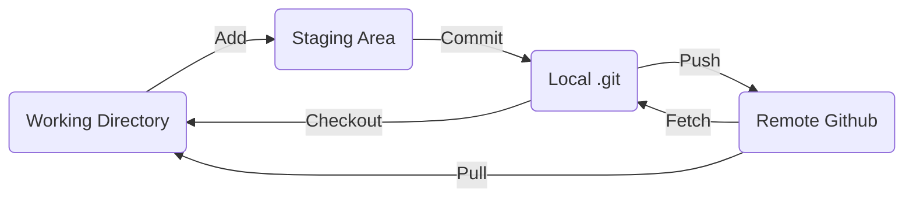

## GIT

VCS ( Version Control System ) 로 버전 관리 및 협업을 위해 사용됩니다.

---

### 1. 기초

1. Git 구성 요소
	- Blob : 파일 하나의 내용에 대한 정보
	- Tree : Blob 이나 Subtree 의 메타데이터 (디렉토리 위치, 속성, 이름 등)
	- Commit : 커밋 순간의 스냅샷

2. Git **Process Flow** , **Command**

   - Local 영역 : Working Directory, Staging Area, Local .git
   - Remote 영역 : Remote Github

---

### 2. 설치

1. Git 설치<br>
	> [윈도우 Git 설치 링크](https://gitforwindows.org/)

2. Git 설치 확인 및 환경설정
	> ```shell
	> $ git -v
	> $ git config --global user.name "유저네임"
	> $ git config --global user.email "메일주소"
	> $ git config --global core.editor "vim"
	> $ git config --global core.pager "cat"
	> ```

3. Github 가입 <br/>
	> [Github 홈페이지](https://github.com/)

---

### 3. Github Repo 구성 및 Clone 저장

1. Github Repo 생성

	>  <br>
	> 'Your repositories' 선택

	>  <br>
	> 'New' 아이콘 선택

	>  <br>
	> ① : 사용하고자 하는 'Repository name' 작성 <br>
	> ② : Repository 첫 화면에 나오는 README 파일 생성 여부 선택 <br>
	> ③ : 위 단계 후 Repository 생성

2. Github Repository 링크 복사
	>  <br>
	> ① : (3-1) 단계에서 만든 Repo 선택 <br>
	> ② : 'Code' 클릭 <br>
	> ③ : 링크 복사

3. Git bash 를 통해 Github Repo 연결
	> ```shell
	> $ git clone [복사한 링크]
	> ```
	> clone 명령어로 github repo 로컬 디렉토리에 저장

---

### 4. Git Add / Commit / Push 사용
상단의 [Git Process](#1-기초)에서 이해한 명령어 사용 방법
1. Git Add
   > ```shell
   > $ git add [파일명]
   > ```
   > Git Clone 한 디렉토리에서 Github 에 업로드하고자하는 파일을 Staging Area 로 전달

2. Git Commit
   > ```shell
   > $ git commit
   > ```
   > Git Add 한 파일을 Local git repo 에 전달<br> **(Local git Repo 가 의미하는게 뭔지 모르겠다, 정확한 의미를 찾아봐야 함)**

3. Git Push
	> ```shell
	> $ git push origin main
	> ```
	> - origin : Git Remote Repository 를 의미하는 **기본 별칭**으로 'git remote -v' 를 통해 자세한 경로를 확인할 수 있다.
	> - main : main branch 를 Push

기본적인 사용방법은 위와 같으며 자세한 옵션이나 명령어는 [Git Doc](https://ndpsoftware.com/git-cheatsheet.html#loc=workspace;)을 참고하면서 알아가야겠다.

---

### 5. Git Branch
기본적으로 사용되는 Main Branch 에서 별도로 파생되는 특정 Branch 들을 만들어 여러가지 버전을 생성, 수정, 적용이 가능

1. Git Branch 생성
   > ```shell
   > $ git branch [branch 이름]
   > ```
   > 현재 위치한 branch 에서 분기점의 branch 를 생성

2. 작업 Branch 위치 전환
	> ```shell
	> $ git switch [branch 이름]
	> ```
	> 특정 branch 로 작업 위치 전환

3. 특정 Branch 를 Main 으로 통합
	> ```shell
	> $ git switch main (main으로 통합을 위해 main 으로 이동)
	> $ git merge [branch 이름]
	> ```
	> main 으로 통합 후 [`4. Git 과정`](#4-git-add--commit--push-사용) 을 진행하여 github에 배포

4. 특정 Branch 삭제
	> ```shell
	> $ git branch -D [banch 이름]
	> ```

